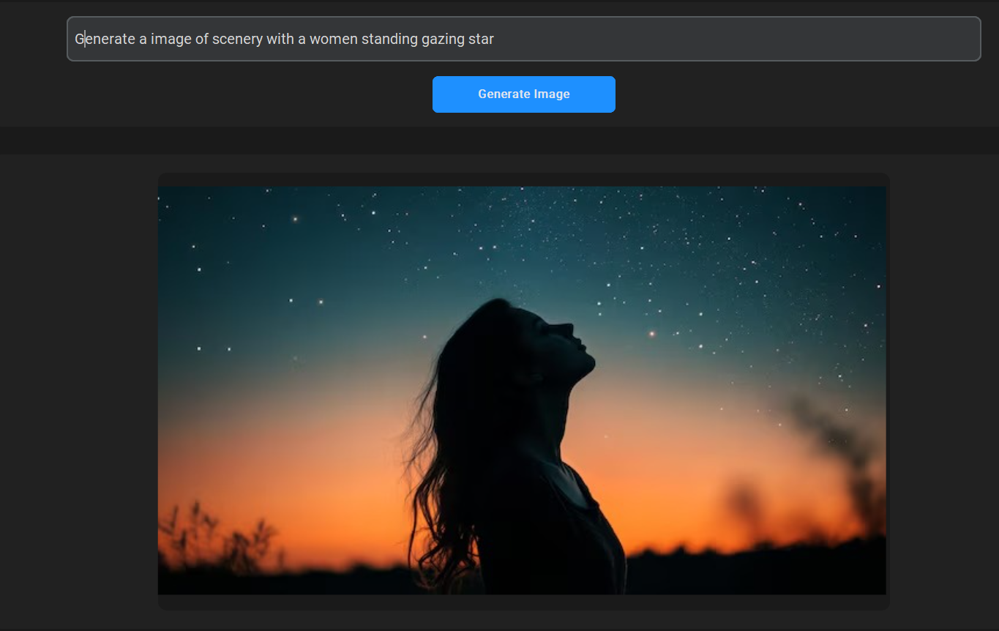

## 🎨 PromptCanvas: AI-Powered Text-to-Image Studio
**PromptCanvas** is a desktop application that allows users to generate high-quality, AI-generated images from text prompts using the power of **Stable Diffusion**. Built with `Python`, `customtkinter` for the GUI, and `diffusers` from Hugging Face, this project offers a beautiful and responsive interface for creative AI exploration.

---

## 🚀 Features

- 🧠 Powered by **Stable Diffusion v1.4**
- 🖼️ Generate realistic images from natural language prompts
- 💻 Desktop GUI built with `customtkinter` (dark mode support)
- 📦 Save generated images locally
- ⚙️ Real-time progress bar and error handling
- 🔁 Responsive across both CPU and GPU (with autocast for float16 if CUDA available)

---

## 📷 Demo



---

## 🛠️ Installation

### 1. Clone the repository

```bash
git clone https://github.com/yourusername/promptcanvas-ai-studio.git
cd promptcanvas-ai-studio
````

### 2. Set up a virtual environment (optional but recommended)

```bash
python -m venv venv
source venv/bin/activate  # On Windows: venv\Scripts\activate
```

### 3. Install required dependencies

```bash
pip install -r requirements.txt
```

**Requirements:**

* torch
* diffusers
* customtkinter
* pillow

Or install manually:

```bash
pip install torch diffusers customtkinter pillow
```

---

## 🔑 Hugging Face Token Setup

To use **Stable Diffusion**, you need a Hugging Face token:

1. Sign in to [Hugging Face](https://huggingface.co)
2. Go to your [Access Tokens](https://huggingface.co/settings/tokens)
3. Create a new token with "read" permission
4. Replace the token inside `self.auth_token` in the app:

```python
self.auth_token = "hf_your_token_here"
```

---

## ▶️ Running the Application

```bash
python app.py
```

Once the app launches, enter your prompt (e.g., *"a futuristic cityscape at sunset"*) and click **Generate Image**. The image will be generated and displayed in the UI.

---

## 📁 Project Structure

```
promptcanvas/
│
├── app.py                 # Main application file
├── requirements.txt       # Python dependencies
├── screenshot.png         # Demo screenshot
└── generated_image.png    # Output placeholder
```

---

## ✅ Tested On

* Python 3.8+
* Windows 10/11 and Ubuntu 22.04
* NVIDIA GPU (optional but recommended for faster generation)

---

## 📌 Future Enhancements

* Allow custom image resolution selection
* Support model switching (SDXL, Dreamlike, etc.)
* Web-based version using Gradio/Streamlit
* Built-in prompt enhancement with NLP models
* Save image history/gallery

---

## 📄 License

This project is licensed under the [MIT License](LICENSE).

---

## 🙌 Acknowledgements

* [Hugging Face 🤗 Diffusers](https://huggingface.co/docs/diffusers/index)
* [Stable Diffusion v1.4 by CompVis](https://huggingface.co/CompVis/stable-diffusion-v1-4)
* [customtkinter](https://github.com/TomSchimansky/CustomTkinter)

---

